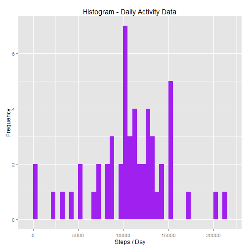
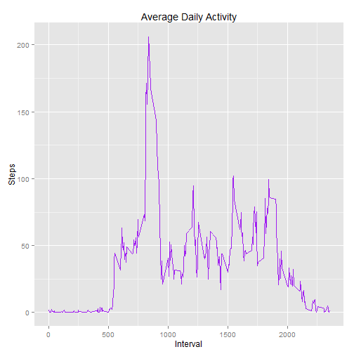
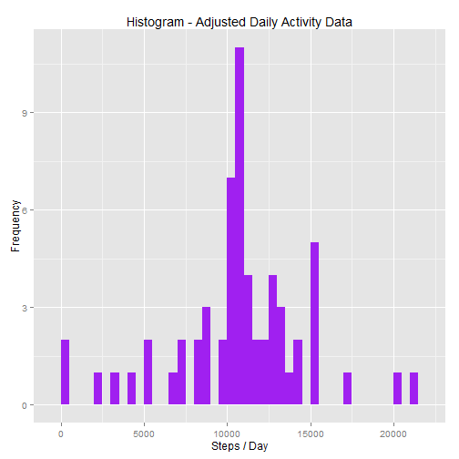
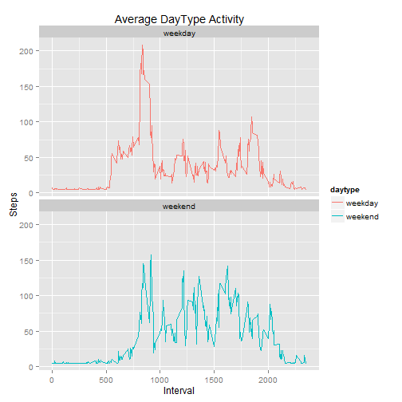

#-------------------------------------------------------------------------------------------------
#Data 
#-------------------------------------------------------------------------------------------------

Dataset: Activity monitoring data [52K], filename = activity.csv

The variables included in this dataset are:

- steps: Number of steps taking in a 5-minute interval (missing values are coded as NA)
-  date: The date on which the measurement was taken in YYYY-MM-DD format
-	interval: Identifier for the 5-minute interval in which measurement was taken

The dataset is stored in a comma-separated-value (CSV) file and there are a total of 17,568 observations in this dataset.


```r
    filepath<- "E:/1Rdata/activity.csv"
    actdata<- read.csv(filepath,header=T,sep = ",",na.strings = "NA",stringsAsFactors=FALSE)

    rowcnt<- nrow(actdata)
    head(actdata)
```

```
##   steps       date interval
## 1    NA 2012-10-01        0
## 2    NA 2012-10-01        5
## 3    NA 2012-10-01       10
## 4    NA 2012-10-01       15
## 5    NA 2012-10-01       20
## 6    NA 2012-10-01       25
```

#
#

There were 17568 rows loaded into actdata.   


##-----------------------------------------------------------------------------------------------------------------
### What is mean total number of steps taken per day?


- Calculate and report the mean and median of the total number of steps taken per day
- Make a histogram of the total number of steps taken each day
  
##-----------------------------------------------------------------------------------------------------------------

#### Calculate Steps Stats


```r
## aggregate steps for intervals by date  
  sum_actdata <- aggregate (steps ~ date, actdata, FUN = sum)
```


```r
  gtsum_steps <- format(sum(sum_actdata$steps, na.rm = T), digits = 5)
  gtmean_steps <- format(mean(sum_actdata$steps, na.rm = T), digits = 5)
  gtmedian_steps <- format(median(sum_actdata$steps, na.rm = T), digits = 6, nsmall = 1)
```
##
##

Mean total number of steps taken = 10766 . 

Median total number of steps taken  = 10765 .

##
##

#### Histogram of Total Steps / Day


```r
  library(ggplot2)  

  histdata <- aggregate (steps ~ date, actdata, FUN = sum)
  histdata$plotdate <- as.Date(histdata$date, format="%Y-%m-%d")

  ggplot(histdata, aes(x = steps)) +
    geom_histogram(fill = "purple", binwidth = 500) +
    labs(title = "Histogram - Daily Activity Data", x = "Steps / Day", y = "Frequency") 
```

 


#-----------------------------------------------------------------------------------------------------------------

### What is the average daily activity pattern?

  - Make a time series plot of the 5-minute interval (x-axis) and the average number of steps taken, averaged across all days (y-axis)
  - Which 5-minute interval, on average across all the days in the dataset, contains the maximum number of steps?


#-----------------------------------------------------------------------------------------------------------------

#### Time Series plot of Average Daily Activity


```r
    mean_actdata_interval <- aggregate (steps ~ interval, actdata, FUN = mean)

    ggplot(mean_actdata_interval, aes(x=interval, y=steps)) +
      geom_line(color = "purple") + 
      labs(title = "Average Daily Activity", x = "Interval", y = "Steps") 
```

 


#### Determine which Interval has the maximum daily average. 


```r
## Determine Max 5 Minute Interval

    max_interval <- mean_actdata_interval$interval[which.max(mean_actdata_interval$steps)]
```


The time interval with the maximum number of steps = 835.

#-----------------------------------------------------------------------------------------------------------------
## Imputing missing values

#-----------------------------------------------------------------------------------------------------------------
  
  
#### Calculate and report the total number of missing values in the dataset


```r
   actdata_nas <- sum(is.na(actdata$steps))
```

 There are 2304 missing values (NAs) in the dataset Activity.csv.

#-----------------------------------------------------------------------------------------------------------------


#### Devise a strategy for filling in all of the missing values in the dataset. 

For the purposes of this analysis I chose to set the NAs to the population average of steps.   

#-----------------------------------------------------------------------------------------------------------------


#### Create a new dataset that is equal to the original dataset but with the missing data filled in.


```r
actdata_transf <- transform(actdata, ImputedInt = ifelse(is.na(actdata$steps), mean(actdata$steps, na.rm=TRUE), actdata$steps))

actdata_transf_nas <- sum(is.na(actdata_transf$ImputedInt))

head(actdata_transf)
```

```
##   steps       date interval ImputedInt
## 1    NA 2012-10-01        0    37.3826
## 2    NA 2012-10-01        5    37.3826
## 3    NA 2012-10-01       10    37.3826
## 4    NA 2012-10-01       15    37.3826
## 5    NA 2012-10-01       20    37.3826
## 6    NA 2012-10-01       25    37.3826
```

The transformed dataset has 0 NA values. 

#-----------------------------------------------------------------------------------------------------------------

#### Make a histogram of the total number of steps taken each day. 


```r
  histdata2 <- aggregate (ImputedInt ~ date, actdata_transf, FUN = sum)
  histdata2$plotdate <- as.Date(histdata2$date, format="%Y-%m-%d")

  ggplot(histdata2, aes(x = ImputedInt)) +
    geom_histogram(fill = "purple", binwidth = 500) +
    labs(title = "Histogram - Adjusted Daily Activity Data", x = "Steps / Day", y = "Frequency") 
```

 


#-----------------------------------------------------------------------------------------------------------------

#### Calculate and report the mean and median total number of steps taken per day.  


```r
  gtsum_tsteps <- format(sum(histdata2$ImputedInt), digits = 5)
  gtmean_tsteps <- format(mean(histdata2$ImputedInt), digits = 5)
  gtmedian_tsteps <- format(median(histdata2$ImputedInt), digits = 5)
```


The mean for the transformed data set = 10766. 

The median for the transformed data set = 10766. 


#-----------------------------------------------------------------------------------------------------------------
#### Do these values differ from the estimates from the first part of the assignment? 


Mean w / NAs =  10766.    <-------->   Mean w/o NAs = 10766 . 

Median w / NAs =  10765.   <-------->   Median w/o NAs = 10766.

There was no significant change in the mean and median values. 


#-----------------------------------------------------------------------------------------------------------------


#### What is the impact of imputing missing data on the estimates of the total daily number of steps?


Total Steps with NAs = 570608  <-------->   Total Steps with NAs = 656738


Total steps for the transformed data set increased because NAs were replaced with the average step value.  

#-----------------------------------------------------------------------------------------------------------------

## Are there differences in activity patterns between weekdays and weekends?


 - Make a panel plot containing a time series plot of the 5 min interval (x) and the average steps taken averaged across all week day days or weekend days (y).


#-----------------------------------------------------------------------------------------------------------------


##   
##  

#### Add daytype factor (weekday or weekend)


```r
library(dplyr)
  
  actdata_transf$plotdate <- as.Date(actdata_transf$date, format="%Y-%m-%d")

  actdata_daytype <- mutate(actdata_transf, daytype = ifelse(weekdays(actdata_transf$plotdate) == 
    "Saturday" | weekdays(actdata_transf$plotdate) == "Sunday", "weekend", "weekday"))
      actdata_transf$daytype <- as.factor(actdata_transf$plotdate)
```

##    
##     

#### Panel plot of daytype (weekday or weekend)

##         
##           


```r
  daytypeplot<- aggregate( ImputedInt ~ daytype * interval, actdata_daytype, FUN =  mean)

  ggplot(daytypeplot, aes(x=interval, y=ImputedInt, color = daytype)) +
    geom_line() + facet_wrap( ~ daytype, ncol = 1, nrow=2)  +
    labs(title = "Average DayType Activity", x = "Interval", y = "Steps") 
```

 


